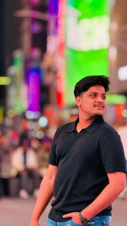

-HTML-
<!DOCTYPE html>
<html lang="en">
<head>
    <meta charset="UTF-8">
    <meta name="viewport" content="width=device-width, initial-scale=1.0">
    <title>KAILASH's Portfolio</title>
    <link rel="stylesheet" href="style.css">
</head>
<body>
    <header>
        <h1>UPPULURI VENKAT KAILASH</h1>
        <nav>
            <a href="#home">Home</a>
            <a href="#about">About</a>
            <a href="#portfolio">Portfolio</a>
            <a href="#contact">Contact</a>
        </nav>
    </header>

    <section id="home">
        

            <h2>Welcome to My Professional World</h2>
            
Explore my projects and professional journey.

        

    </section>

    <section id="about">
        <h2>About Me</h2>
        
        
I am currently pursuing a Master's in Computer Science at Sacred Heart University, with a background in Electronics and Communication Engineering from Sasi Institute of Technology and Engineering. My technical skills span programming languages including C, Python, and Java, and I have a demonstrated history of engaging in competitive academic activities and workshops related to technology. I am passionate about expanding my technical expertise and applying my skills in innovative and challenging environments.

    </section>

    <section id="portfolio">
        <h2 style="margin-bottom: 10px;">My Work</h2>

        

			
				<h3>Dashboard</h3>
				
Developed a comprehensive dashboard using React and Redux to enable real-time data visualization and enhance business decision-making capabilities.

		

        

            
            <h3>EcoTracker</h3>
        
Created an Android application to help users track and improve their environmental footprint, utilizing Java and Google Firebase for backend operations.

        

        

             <h3>Library Website</h3>
           
Designed and developed a website for a local library to enhance user engagement and provide easy access to library resources, including a searchable catalog and event management.

        

    </section>

    <section id="contact">
        <h2>Contact Me</h2>
        <form>
            <input type="text" name="name" placeholder="Your Name" required>
            <input type="email" name="email" placeholder="Your Email" required>
            <textarea name="message" placeholder="Your Message" required></textarea>
            <button type="submit">Send</button>
        </form>
    </section>

    <footer>
        
        <a href="" target="_blank"><i class="fab fa-linkedin"></i></a>
        
© 2024 UPPULURI VENKAT KAILASH. All rights reserved.

    </footer>

    
</body>
</html>
-CSS-
* {
    margin: 0;
    padding: 0;
    box-sizing: border-box;
    scroll-behavior: smooth;
}

body {
    font-family: 'Arial', sans-serif;
    background-image: url('https://cdn.pixabay.com/photo/2013/05/12/18/55/balance-110850_1280.jpg');
    color: #333;
    padding-top: 70px;
    scroll-padding-top: 120px;
}

header {
    position: fixed;
    width: 100%;
    background-color: #005f73;
    color: white;
    padding: 15px 20px;
    top: 0;
    z-index: 1000;
}

nav a {
    margin: 0 15px;
    color: white;
    text-decoration: none;
    font-size: 1.2em;
}

nav a:hover {
    color: #ffb703;
}

section {
    padding: 40px 20px;
    text-align: center;
    margin: 0 auto;
    max-width: 1200px;
    background: #edf6f9;
    box-shadow: 0 8px 16px rgba(0,0,0,0.7);
    margin-bottom: 20px;
    border-radius: 10px;
}

.project {
    display: flex;
    align-items: start;
    justify-content: center;
    width: 100%;
    background: #ffffff;
    box-shadow: 0 6px 12px rgba(0,0,0,0.5);
    padding: 20px;
    margin-bottom: 20px;
    border-radius: 8px;
}

.project img {
    width: 300px;
    height: 150px;
    object-fit: cover;
    margin-right: 20px;
    border-radius: 4px;
}

.project-info {
    flex: 1;
    text-align: left;
}

#contact form {
    display: grid;
    grid-template-columns: 1fr 1fr; 
    grid-gap: 20px;
    align-items: center;
    margin-bottom: 20px;
}

#contact form input, #contact form textarea {
    width: 100%;
    padding: 12px;
    border-radius: 4px;
    border: 1px solid #ccc;
}

#contact form textarea {
    grid-column: 1 / 3; 
}

button {
    width: 100%;
    padding: 10px;
    background-color: #023047;
    color: white;
    border: none;
    cursor: pointer;
    border-radius: 4px;
}

footer {
    background-color: #023047;
    color: white;
    text-align: center;
    padding: 20px;
}

footer a {
    color: white;
    font-size: 1.5em;
    margin: 0 10px;
}

@media (max-width: 600px) {
    .project {
        flex-direction: column;
    }

    .project img {
        width: 90%;
        margin-bottom: 20px;
    }

    nav a {
        display:block;
        padding: 10px 0;
    }

    #contact form {
        grid-template-columns: 1fr; 
    }

    #contact form textarea {
        grid-column: 1; 
    }
}
